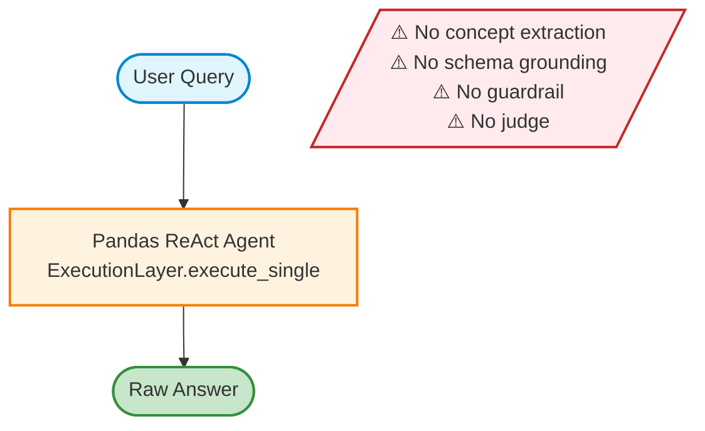

# AutoIOT-Only Baseline Flow

Direct execution baseline with no preprocessing or verification layers.

## Characteristics

- **Simplest baseline**: Raw query sent directly to pandas agent
- **No preprocessing**: Cannot resolve activity names (e.g., "Walking") to codes (e.g., "A")
- **No derived features**: Missing `magnitude` and `activity_name` columns
- **No safety checks**: Executes all queries including out-of-scope requests
- **No verification**: No post-execution judge to validate intent alignment

## Expected Behavior

| Query Type | Behavior |
|------------|----------|
| Direct Answer (Q1-Q4) | ✓ May execute correctly if query maps directly to raw columns |
| Intermediate Reasoning (Q5-Q8) | ⚠️ Likely incorrect due to missing grounding and derived features |
| Out-of-Scope (Q9-Q12) | ⚠️ Executes with low-quality/unsupported answers (no rejection) |

## Code Reference

See [flashfusion/baselines/autoiot_only.py](../flashfusion/baselines/autoiot_only.py#L34-L56)
