# Baseline Comparison: System Architecture

Comparative view of all three baselines showing incremental capability enhancement.

```mermaid
flowchart TD
    subgraph Agent["Agent-Only"]
        A1([Query]) --> A2[Pandas Agent] --> A3([Answer])
        style A2 fill:#fff3e0,stroke:#f57c00
    end
    
    subgraph WellMax["WellMax-Only"]
        W1([Query]) --> W2[S1: Concepts]
        W2 --> W3[S2: Grounding<br/>+ Codebook]
        W3 --> W4[S3: Sub-queries]
        W4 --> W5[Pandas Agent]
        W5 --> W6([Answer])
        style W2 fill:#f3e5f5,stroke:#7b1fa2
        style W3 fill:#f3e5f5,stroke:#7b1fa2
        style W4 fill:#f3e5f5,stroke:#7b1fa2
        style W5 fill:#fff3e0,stroke:#f57c00
    end
    
    subgraph FlashFusion["Flash-Fusion"]
        F1([Query]) --> F2[S1: Concepts]
        F2 --> F3[S2: Grounding<br/>+ Codebook]
        F3 --> F4[S3: Sub-queries]
        F4 --> F5{Guardrail}
        F5 -->|REJECT| F6([Rejection])
        F5 -->|PROCEED| F7[Pandas Agent]
        F7 --> F8{Judge}
        F8 -->|PASS| F9([Answer])
        F8 -->|FAIL| F10[Retry]
        F10 --> F11[Agent Retry]
        F11 --> F12{Re-judge}
        F12 --> F13([Answer])
        style F2 fill:#f3e5f5,stroke:#7b1fa2
        style F3 fill:#f3e5f5,stroke:#7b1fa2
        style F4 fill:#f3e5f5,stroke:#7b1fa2
        style F5 fill:#fff176,stroke:#f57f17,stroke-width:3px
        style F6 fill:#ffcdd2,stroke:#c62828
        style F7 fill:#fff3e0,stroke:#f57c00
        style F8 fill:#81d4fa,stroke:#0277bd,stroke-width:3px
        style F9 fill:#c8e6c9,stroke:#388e3c
        style F10 fill:#ffccbc,stroke:#d84315
        style F11 fill:#ffe0b2,stroke:#e65100
        style F12 fill:#81d4fa,stroke:#0277bd,stroke-width:3px
        style F13 fill:#c8e6c9,stroke:#388e3c
    end
    
    style Agent fill:#fff8e1,stroke:#f57c00,stroke-width:2px
    style WellMax fill:#f3e5f5,stroke:#7b1fa2,stroke-width:2px
    style FlashFusion fill:#e8f5e9,stroke:#388e3c,stroke-width:3px
```



## Capability Comparison

| Capability | Agent-Only | WellMax-Only | Flash-Fusion |
|------------|:------------:|:------------:|:------------:|
| **Real data execution** (pandas agent) | ✅ | ✅ | ✅ |
| **Column grounding** via S1+S2 | ❌ | ✅ | ✅ |
| **Activity codebook** injection | ❌ | ✅ | ✅ |
| **Derived features** (`magnitude`, `activity_name`) | ❌ | ✅ | ✅ |
| **Query decomposition** via S3 | ❌ | ✅ | ✅ |
| **Guardrail** on grounded query | ❌ | ❌ | ✅ |
| **Post-execution judge** + retry | ❌ | ❌ | ✅ |

## Performance Characteristics

### Agent-Only
- **Latency**: ~5-10s (fastest — no preprocessing)
- **Token cost**: Lowest (~200-300 total tokens)
- **Accuracy**: Poor on queries requiring grounding or derived features
- **Rejection rate**: 0% (executes everything)

### WellMax-Only
- **Latency**: ~8-15s (3 stage calls + agent)
- **Token cost**: Medium (~900-1100 total tokens)
- **Accuracy**: Good on in-scope queries, poor rejection behavior
- **Rejection rate**: 0% (no guardrail)

### Flash-Fusion
- **Latency**: ~10-20s (stages + guardrail + agent + judge ± retry)
- **Token cost**: Highest (~1200-1400 total tokens, ~2000 with retry)
- **Accuracy**: Best overall (grounding + verification + adaptive retry)
- **Rejection rate**: High for out-of-scope (guardrail rejects ~33% of benchmark)

## Incremental Enhancement Path

```
Agent-Only → WellMax-Only → Flash-Fusion
     ↓              ↓              ↓
  Execution    Grounding    Safety Gates
   Only         Pipeline     + Verification
```

### Key Transitions

1. **Agent → WellMax**: Add 3-stage grounding pipeline
   - Enables concept-to-column mapping
   - Injects domain knowledge (activity codebook)
   - Materializes derived features

2. **WellMax → Flash-Fusion**: Add guardrail + judge
   - Reject out-of-scope queries before execution
   - Validate intent alignment after execution
   - Adaptive retry with correction notes

## Benchmark Results (12 WISDM Queries)

Based on [eval_results/runs/latest/](../flashfusion/eval_results/runs/latest/):

### Semantic Accuracy (vs Ground Truth)

| Baseline | Avg Score | Notes |
|----------|:---------:|-------|
| **Flash-Fusion** | **0.52** | Best accuracy with judge retry |
| **WellMax-Only** | **0.25** | Grounding helps but no verification |
| **Agent-Only** | **0.22** | Missing grounding hurts performance |

### LLM Judge Score (Intent Alignment)

| Baseline | Avg Score | Pass Rate | Notes |
|----------|:---------:|:---------:|-------|
| **Flash-Fusion** | **0.92** | **92%** | Judge + retry ensures alignment |
| **WellMax-Only** | **0.50** | **50%** | Execution correct but no verification |
| **Agent-Only** | **0.40** | **33%** | Frequent misalignment |

### Efficiency Metrics

| Baseline | Avg Latency | Avg Token Cost | Notes |
|----------|:-----------:|:--------------:|-------|
| **Flash-Fusion** | 6.6s | $0.00081 | Highest cost for best accuracy |
| **WellMax-Only** | 9.6s | $0.00064 | Mid-range |
| **Agent-Only** | 7.2s | $0.00023 | Cheapest but least accurate |

## Architecture Decision Rationale

### Why Three Baselines?

1. **Agent-Only**: Isolates value of code execution alone
2. **WellMax-Only**: Isolates value of grounding pipeline
3. **Flash-Fusion**: Demonstrates value of verification layer

### Design Philosophy

- **Incremental complexity**: Each baseline adds one capability layer
- **Ablation study**: Enables measuring contribution of each component
- **Real-world tradeoffs**: Shows accuracy vs latency vs cost spectrum

## Code References

- Agent: [baselines/agent_only.py](../flashfusion/baselines/agent_only.py)
- WellMax: [baselines/wellmax_only.py](../flashfusion/baselines/wellmax_only.py)
- Flash-Fusion: [baselines/flash_fusion.py](../flashfusion/baselines/flash_fusion.py)
- Architecture overview: [CLAUDE.md](../flashfusion/CLAUDE.md#L32-L65)
