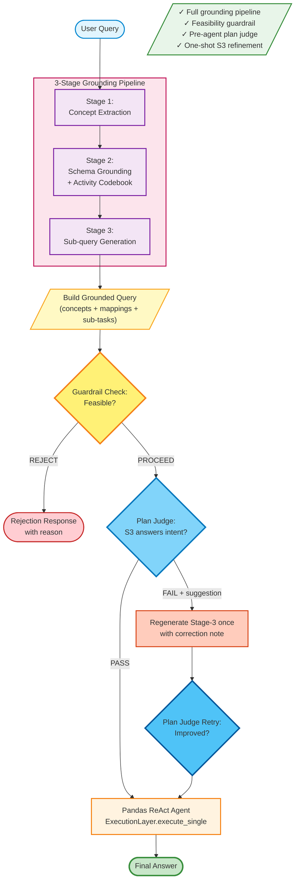

# Flash-Fusion Baseline Flow

Full pipeline with safety gates and pre-execution plan refinement.

## Characteristics

- **Full grounding pipeline**: S1 → S2 → S3 with codebook and derived features
- **Feasibility guardrail**: Rejects queries requiring unavailable schema before execution
- **Plan judge**: Validates Stage-3 decomposition before any code execution
- **Adaptive plan refinement**: If plan judge returns FAIL + suggestion, regenerates S3 once
- **Single-pass execution**: Agent executes once after plan acceptance

## Stage Details

### Stages 1-3: Grounding Pipeline
Same as WellMax-Only (see [wellmax_baseline_flow.md](wellmax_baseline_flow.md))

### Guardrail Check
- **Input**: Grounded query (after S1-S2-S3)
- **Logic**: Verifies query can be answered from available dataset fields
- **Output**: `PROCEED` or `REJECT: <reason>`
- **Rejection examples**: Queries requiring age, gender, GPS location, predictive forecasting

### Plan Judge
- **Input**: Original query, S2 grounding, S3 sub-queries, synthesis hint
- **Logic**: LLM validates whether the decomposition is complete, ordered, and executable
- **Output**: `{"verdict": "PASS"|"FAIL", "suggestion": "..."|null}`
- **Refinement trigger**: FAIL + non-null suggestion → regenerate Stage-3 once

### Plan Refinement Mechanism
1. Append correction note to Stage-3 query context
2. Regenerate sub-queries and synthesis hint once
3. Rebuild grounded query and re-run plan judge
4. Execute pandas agent after plan gate is satisfied

## Expected Behavior

| Query Type | Behavior |
|------------|----------|
| Direct Answer (Q1-Q4) | ✓ High accuracy with grounding |
| Intermediate Reasoning (Q5-Q8) | ✓ Improved decomposition via plan judge + one refinement |
| Out-of-Scope (Q9-Q12) | ✓ Rejected by guardrail with clear reason |

## Code Reference

See [flashfusion/baselines/flash_fusion.py](../flashfusion/baselines/flash_fusion.py)
- Guardrail check: `guardrail`
- Plan judge gate: `judge_plan`
- One-shot plan refinement: `S3_refine` + `judge_plan_retry`
