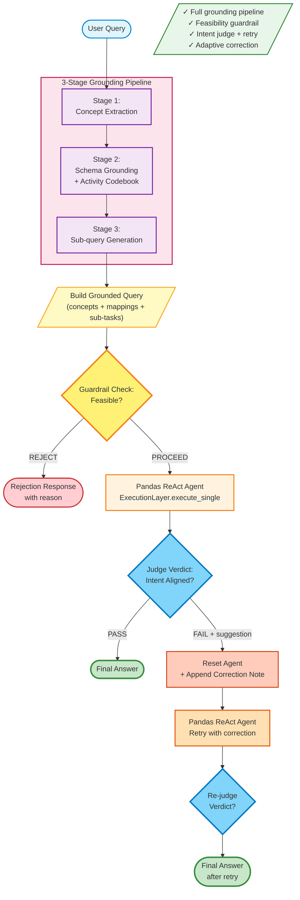

# Flash-Fusion Baseline Flow

Full pipeline with safety gates, verification, and adaptive retry logic.

## Characteristics

- **Full grounding pipeline**: S1 → S2 → S3 with codebook and derived features
- **Feasibility guardrail**: Rejects queries requiring unavailable schema before execution
- **Intent judge**: Validates that agent's answer aligns with user's original question
- **Adaptive retry**: If judge returns FAIL + suggestion, retries with correction appended
- **One retry only**: Single retry attempt to balance accuracy and latency

## Stage Details

### Stages 1-3: Grounding Pipeline
Same as WellMax-Only (see [wellmax_baseline_flow.md](wellmax_baseline_flow.md))

### Guardrail Check
- **Input**: Grounded query (after S1-S2-S3)
- **Logic**: Verifies query can be answered from available dataset fields
- **Output**: `PROCEED` or `REJECT: <reason>`
- **Rejection examples**: Queries requiring age, gender, GPS location, predictive forecasting

### Judge Verdict
- **Input**: Original query, final code, raw answer
- **Logic**: LLM validates intent alignment between query and answer
- **Output**: `{"verdict": "PASS"|"FAIL", "suggestion": "..."|null}`
- **Retry trigger**: FAIL + non-null suggestion → retry with correction note

### Retry Mechanism
1. Reset agent state
2. Append correction note to grounded query: `"\n\nCorrection note: {suggestion}"`
3. Re-execute agent with modified query
4. Re-judge final answer
5. Return retry result as final answer (no further retries)

## Expected Behavior

| Query Type | Behavior |
|------------|----------|
| Direct Answer (Q1-Q4) | ✓ High accuracy with grounding |
| Intermediate Reasoning (Q5-Q8) | ✓ Best performance with judge retry |
| Out-of-Scope (Q9-Q12) | ✓ Rejected by guardrail with clear reason |

## Code Reference

See [flashfusion/baselines/flash_fusion.py](../flashfusion/baselines/flash_fusion.py#L49-L157)
- Guardrail check: line 102
- Judge verdict: line 136
- Retry logic: lines 143-157
