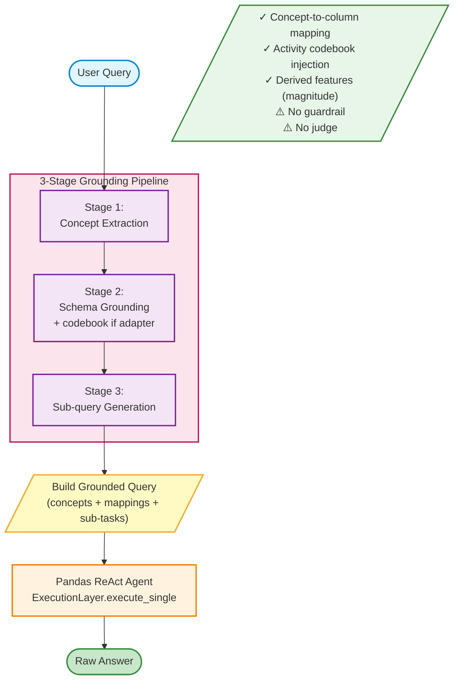

# WellMax-Only Baseline Flow

Three-stage query grounding pipeline without safety gates or verification.

## Characteristics

- **Grounded execution**: Maps indirect concepts (e.g., "sedentary") to exact columns before execution
- **Activity codebook**: S2 injects mapping (A=Walking, B=Jogging, C=Stairs, etc.) when adapter is provided
- **Derived features**: `magnitude` and `activity_name` are available when adapter-derived features are applied by the runner
- **Query decomposition**: S3 breaks complex queries into sub-tasks for agent
- **No safety gates**: Missing guardrail (executes out-of-scope) and judge (no retry)

## Stage Details

### Stage 1: Concept Extraction
Classifies query concepts as DATA (column-mappable) or REASONING (proxy-required)

### Stage 2: Schema Grounding
- Maps DATA concepts → actual column names
- Maps REASONING concepts → column + operation proxies
- Injects activity codebook for label resolution

### Stage 3: Sub-query Generation
Decomposes abstract query into 2-4 concrete, column-grounded sub-questions

## Expected Behavior

| Query Type | Behavior |
|------------|----------|
| Direct Answer (Q1-Q4) | ✓ Typically correct due to grounding |
| Intermediate Reasoning (Q5-Q8) | ✓ Stronger execution vs AutoIOT (has derived features) |
| Out-of-Scope (Q9-Q12) | ⚠️ Still executes with weak/unsupported results (no guardrail) |

## Code Reference

See [flashfusion/baselines/wellmax_only.py](../flashfusion/baselines/wellmax_only.py#L47-L95)
